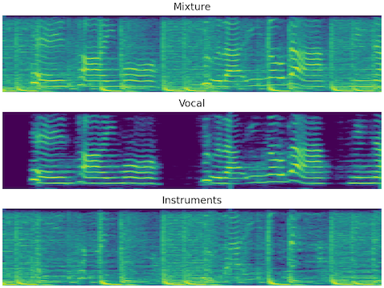

# torch-chimera
Unofficial pytorch implementation of deep clustering family

### Summary

This repo is an **unofficial** implementation of deep clustering [Hershey et al. ICASSP (2016)] and its succedents [Luo et al. ICASSP (2017)], [Wang et al. ICASSP (2018)], [Roux et al. ICASSP (2019)], [Roux et al. IEEE JSTSP (2019)].

The purpose of this repo is to perform single-source signal separation with deep neural networks.
Depicting with the following figure, the mixture of vocal and instruments music (top) is given to the model, and the model predicts mixtures sources (i.e. vocal (center) and instruments music (bottom)).



[Hershey et al. ICASSP (2016)]: https://arxiv.org/abs/1508.04306
[Luo et al. ICASSP (2017)]: https://arxiv.org/abs/1611.06265
[Wang et al. ICASSP (2018)]: https://ieeexplore.ieee.org/document/8462507
[Roux et al. ICASSP (2019)]: https://arxiv.org/abs/1810.01395
[Roux et al. IEEE JSTSP (2019)]: https://arxiv.org/abs/1810.01395

### Requirements

* `ffmpeg` : 4.2
* `numpy` : 1.18.4
* `pysocks` : 1.7.1
* `pysoundfile` : 0.10.2
* `python` : 3.7.6
* `pytorch` : 1.5.0
* `resampy` : 0.2.2
* `scikit-learn` : 0.21.3
* `scipy` : 1.4.1
* `torchaudio` : 0.5.0

See `requirements.txt` for more information.

### Prediction with pretrained models

#### Pretrained models

The pretrained models are based on the phasebook model [Roux et al. ICASSP (2019)].

##### Models trained on DSD100

These models are trained with 

- sr = 44100
- fft-size = 1024
- hop-length = 256
- frame size per sample: ≈500 (3 seconds)
- N(unit size) = 600 for each BLSTM layer
- the other parameters: the same as [Roux et al. ICASSP (2019)].

| loss-function  |  epoch |   SNR |  SI-SDR | Note                                         |
| :------------- | -----: | ----: | ------: | :-------------------------------------       |
| dc             |     10 |  4.27 |    2.22 |                                              |
| dc             |     30 |  3.12 |    0.58 |                                              |
| dc             |     40 |  3.16 |    0.57 |                                              |
| dc             |     50 |  4.13 |    1.97 |                                              |
| dc             |     60 |  3.86 |    1.68 |                                              |
| dc             |     70 |  3.74 |    1.53 |                                              |
| wa             |     10 |  7.05 |    5.67 |                                              |
| wa             |     20 |  7.18 |    5.81 |                                              |
| wa             |     30 |  7.20 |    5.82 | model availables at [model-dsd100-wa-30.pth] |
| wa             |     40 |  7.03 |    5.65 |                                              |
| wa             |     50 |  6.94 |    5.56 |                                              |
| wa             |     60 |  6.98 |    5.60 |                                              |

**Note**: For evaluation, the DSD100 test set was split into 3 seconds of audio, excluding silent frames (< -10db).

[model-dsd100-wa-30.pth]: https://drive.google.com/file/d/1Nk2McY4Csr86mAV-f7qvic5fGM_t9Sx5/view?usp=sharing

##### Models trained on DSD100+MedleyDB and Voxceleb-like dataset

- sr = 44100
- fft-size = 1024
- hop-length = 256
- frame size per sample: ≈500 (3 seconds)
- N(unit size) = 600 for each BLSTM layer
- the other parameters: the same as [Roux et al. ICASSP (2019)].

| loss-function  |  epoch |       snr |     si-sdr | Note |
| :------------- | -----: | --------: | ---------: |      |
| dc             |     10 |  2.691293 |  0.3547386 |      |
| dc             |     20 |  3.065684 |  0.5978485 |      |
| dc             |     30 |  3.555941 |  1.0719946 |      |
| dc             |     40 |  3.696064 |  1.4312759 |      |
| dc             |     50 |  3.987979 |  1.6695048 |      |
| dc             |     60 |  3.965536 |  1.3228118 |      |
| dc             |     70 |  4.123527 |  1.6077654 |      |
| dc             |     80 |  3.897715 |  1.2623440 |      |
| dc             |     90 |  4.289346 |  1.9664130 |      |
| dc             |    100 |  4.326386 |  2.0015590 |      |
| wa             |     10 |  7.793808 |  6.2887853 |      |
| wa             |     20 |  7.924883 |  6.5097553 |      |
| wa             |     30 |  7.828930 |  6.3451356 |      |
| wa             |     40 |  7.950482 |  6.5479744 |      |
| wa             |     50 |  7.900053 |  6.4351206 |      |
| wa             |     60 |  8.098643 |  6.7245795 |      |
| wa             |     70 |  7.918584 |  6.4659921 |      |
| wa             |     80 |  7.964468 |  6.5288680 |      |
| wa             |     90 |  7.775478 |  6.2254487 |      |
| wa             |    100 |  8.174800 |  6.7872839 |      |

**Note**: For evaluation, the DSD100 test set was split into 3 seconds of audio, excluding silent frames (< -10db).

#### Sample script

Source separation can be done with the following script using the model `models/model.pth`.

```shell
python scripts/chimera-torch.py predict \
  --sr 44100 \
  --n-fft 1024 \
  --n-hidden 600 \
  --input-model models/model.pth \
  --input-file mixture.wav \
  --output-files instrumental.wav vocal.wav 
```

### Training a model

TBA
